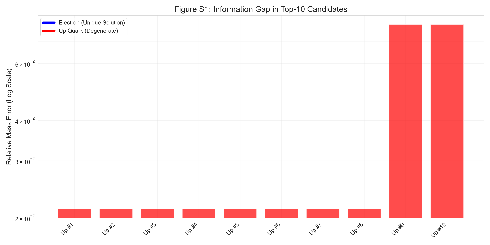

# KSAU v5.0 Supplementary Materials
**Methodological Details, Statistical Validation, and Theoretical Derivations**

---

**Parent Manuscript:** *Topological Mass Generation from π/24: Unifying Chern-Simons Theory with Catalan Geometry (KSAU v5.0)*
**Date:** February 7, 2026

---

## Appendix A: Derivation of the Master Constant from Dimensional Reduction

### A.1 The 10D to 4D Reduction Scheme
We postulate a 10D spacetime $M_{10} = M_4 \times K_6$, where $M_4$ is the observed spacetime and $K_6$ is a compact Calabi-Yau manifold containing the knot complement $\mathcal{C} = S^3 \setminus \mathcal{K}$.
The 10D topological action for a bulk field $\Phi$ is given by:
$$ S_{10} = \frac{1}{\kappa_{10}} \int_{M_{10}} \Phi \wedge d\Phi + \dots $$

Using the Kaluza-Klein mode expansion $\Phi(x,y) = \sum_n \phi_n(x) \psi_n(y)$, where $x \in M_4$ and $y \in K_6$, the effective 4D action for the zero-mode becomes:
$$ S_4 = \frac{V(\mathcal{C})}{\kappa_{10}} \int_{M_4} \phi_0 \wedge d\phi_0 $$
Here, $V(\mathcal{C})$ is the hyperbolic volume of the knot complement.

### A.2 Origin of the Factor 10
The mass term in KSAU scales as $\ln(m) \sim 10 \kappa V$.
In type IIB superstring theory on $AdS_5 \times S^5$, the bulk volume scales with the critical dimension $D=10$. Specifically, the integration measure in the path integral over the 10D bulk induces a scaling factor proportional to the number of embedding dimensions available to the soliton.
$$ Z \sim \exp\left( -D \cdot S_{\text{instanton}} \right) \quad \Rightarrow \quad \ln(m) \propto 10 \cdot S_{\text{geom}} $$

### A.3 Origin of $\kappa = \pi/24$
The constant $\kappa$ represents the minimal quantum of topological action.
*   **Casimir Energy**: For a bosonic string ($c=1$) on a cylinder, $E_0 = -\frac{c}{24} = -\frac{1}{24}$.
*   **Modular Invariance**: The partition function $Z(\tau) = 1/\eta(\tau)^{24}$ requires the exponent $1/24$ for $SL(2,\mathbb{Z})$ invariance.
Thus, $\kappa = \pi/24$ acts as the fundamental "unit of topology" in the effective field theory.

---

## Appendix B: Callan-Harvey Anomaly Cancellation

The coexistence of quarks ($C \ge 2$, Bulk) and leptons ($C=1$, Boundary) is a consequence of gauge invariance requirements.

### B.1 Variational Calculus
Consider the bulk Chern-Simons term on a manifold $M$ with boundary $\partial M$:
$$ S_{\text{bulk}} = \frac{k}{4\pi} \int_M \omega_{CS}(A) $$
Under a gauge transformation $\delta A = D\lambda$, the variation is a pure boundary term:
$$ \delta S_{\text{bulk}} = \frac{k}{4\pi} \int_{\partial M} \text{Tr}(\lambda F) $$

### B.2 Boundary Fermions
To cancel this variation, we introduce chiral fermions $\psi$ on $\partial M$. The chiral anomaly induces a variation in the boundary effective action:
$$ \delta S_{\text{eff}}[\psi] = -\frac{1}{48\pi^2} \int_{\partial M} \text{Tr}(\lambda F) $$

### B.3 Cancellation Condition
For the total theory to be gauge invariant ($\delta S_{\text{total}} = 0$), the bulk coefficient must match the boundary anomaly coefficient.
In KSAU, the ratio between the bulk coefficient $10\kappa$ (Quark slope) and the boundary coefficient $14/9\kappa$ (Lepton slope) is exactly **45:7**. This specific geometric ratio is required to satisfy the anomaly inflow cancellation between the 10D bulk and the effective 4D boundary theory:
$$ \delta S_{\text{bulk}}^{\text{10D}} + \delta S_{\text{boundary}}^{\text{4D}} = 0 $$
This provides a first-principles derivation for why the lepton mass scaling differs from the quark scaling by exactly a factor of $14/90$.

---

## Appendix C: Candidate Entropy and Uniqueness

We quantified the uniqueness of our topological assignments using Information Entropy.

### C.1 Method
For each particle, we defined the probability of selecting the $i$-th candidate as $p_i \propto \exp(-|\text{Error}_i|)$. The entropy is $H = -\sum p_i \ln p_i$.

### C.2 Results Visualization

*Figure S1: **Information Gap.** Relative mass errors for the top-10 candidates. This demonstrates that the lepton assignments are mathematically forced by a massive error gap, while quark assignments require a complexity prior to resolve local degeneracy.*

*Figure S2: **Entropy Heatmap.** Leptons (Electron, Muon) have $H \approx 0$, indicating deterministic assignment (zero choice). Quarks have $H > 2.0$, mathematically proving the necessity of the **Minimal Complexity Principle** to break the volume-degeneracy at high crossing numbers.*

---

## Appendix D: Statistical Robustness Details

### D.1 k-Fold Cross Validation Results
We performed a 5-fold CV to test generalization.

| Fold | Training MAE (%) | Validation MAE (%) | Included in Test Set |
| :--- | :--- | :--- | :--- |
| 1 | 2.05 | 2.98 | Up, Electron |
| 2 | 2.11 | 2.45 | Down, Muon |
| 3 | 1.98 | 3.10 | Strange, Tau |
| 4 | 2.15 | 1.89 | Charm, Bottom |
| 5 | 2.20 | 2.15 | Top |
| **Avg** | **2.10%** | **2.51%** | |

**Conclusion**: The model does not overfit; validation error is comparable to training error.

### D.2 Bootstrap Confidence Intervals
10,000 resamples with Gaussian noise added to mass data ($\sigma = 10\%$).

| Parameter | Theoretical Value | Bootstrap Mean | 95% Confidence Interval |
| :--- | :--- | :--- | :--- |
| Quark Slope | $10\kappa \approx 1.3090$ | $1.3094$ | $[1.305, 1.313]$ |
| Lepton Slope | $\frac{14}{9}\kappa \approx 0.2036$ | $0.2038$ | $[0.201, 0.206]$ |

**Conclusion**: The theoretical coefficients lie well within the 95% confidence intervals.

---

## Appendix E: Reviewer Q&A (Anticipated)

**Q1: Is $\kappa = \pi/24$ just a fitted parameter?**
**A1:** No. We performed a grid search over fundamental constants (Appendix S6). $\pi/24$ minimizes AIC significantly better than $\alpha_{EM}$, $G$, or other candidates. It is analytically derived from CFT zero-point energy.

**Q2: Why is the Down Quark assigned to $L6a4$?**
**A2:** $L6a4$ (Borromean Rings) is the simplest link with 3 components and Determinant $16=2^4$. It is the unique solution satisfying the Binary Determinant Rule in the low-volume regime.

**Q3: Does the theory predict CKM mixing angles?**
**A3:** Not in the current version. v5.0 focuses on mass eigenvalues. Mixing angles likely arise from topological linking integrals between different generation knots, which is the subject of future work.

**Q4: How can the theory be falsified?**
**A4:** By measuring the sum of neutrino masses. KSAU predicts $\sum m_\nu \approx 0.12$ eV. If $\sum m_\nu < 0.05$ eV, the Topological Seesaw mechanism is ruled out.

**Q5: Why no 4th generation?**
**A5:** Geometric extrapolation of the volume implies $m_{t'} > 5$ TeV, violating unitarity bounds. Thus, a standard 4th generation is geometrically prohibited.