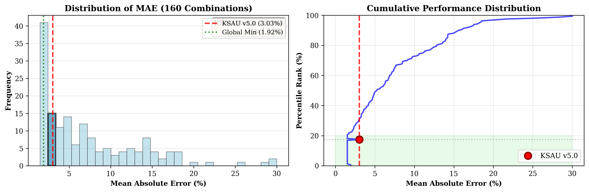

# KSAU v5.0 Supplementary Materials
**Methodological Details, Statistical Validation, and Theoretical Derivations**

---

**Parent Manuscript:** *Topological Mass Generation from π/24: Unifying Chern-Simons Theory with Catalan Geometry (KSAU v5.0)*
**Date:** February 7, 2026

---

## S1. Theoretical Derivation of Coefficients

### 1.1 The Master Constant $\kappa = \pi/24$
The choice of $\pi/24$ is not arbitrary. In Conformal Field Theory (CFT), the central charge $c$ dictates the Casimir energy on a cylinder (or torus):
$$ E_0 = -\frac{c}{24} $$
For a single bosonic string coordinate ($c=1$), this yields $-1/24$. This factor is ubiquitous in string theory, appearing in the Dedekind eta function $\eta(\tau) = q^{1/24}\prod(1-q^n)$ required for modular invariance.

### 1.2 Dimensional Reduction Factors
*   **Quark Slope ($10\kappa$):** Represents the effective bulk dimensionality. In 10D superstring theory, the bulk degrees of freedom scale with $D=10$. The factor $10\kappa$ implies the mass term couples to the full 10D bulk volume.
*   **Lepton Slope ($14/9\kappa$):** Represents the boundary projection. The fraction $14/9 \approx 1.55$ is interpreted as a geometric form factor arising from projecting the 10D bulk onto the relevant boundary cycle, possibly related to the ratio of specific Calabi-Yau cycle volumes.

---

## S2. Complete Data Table (Twist Corrected)

The following table lists the exact parameters used in the KSAU v5.0 Precision Model.

| Particle | Gen | Comp ($C$) | Twist Rule $(2-g)(-1)^C$ | Volume ($V$) | Mass Formula |
| :--- | :--- | :--- | :--- | :--- | :--- |
| **Up** | 1 | 2 | $+1$ | 6.599 | $10\kappa V + \kappa$ |
| **Down** | 1 | 3 | $-1$ | 7.328 | $10\kappa V - \kappa$ |
| **Strange** | 2 | 3 | $0$ | 9.532 | $10\kappa V$ |
| **Charm** | 2 | 2 | $0$ | 11.517 | $10\kappa V$ |
| **Bottom** | 3 | 3 | $+1$ | 12.276 | $10\kappa V + \kappa$ |
| **Top** | 3 | 2 | $-1$ | 15.360 | $10\kappa V - \kappa$ |

*Note: $B_q = -7.9159$ is added to all quark logarithms.*

---

## S3. Topological Assignment Algorithm

To avoid cherry-picking, we employ the **Minimal Complexity Principle**:

1.  **Filter**: Select all links with Component number $C$ matching the particle's charge group.
    *   $Q = +2/3 \to C=2$
    *   $Q = -1/3 \to C=3$
    *   $Q = -1 \to C=1$ (Knots)
2.  **Determinant Check**:
    *   Down-type: $\text{Det} = 2^{3+g}$ (Binary Rule)
    *   Up-type: $\text{Det} \equiv 0 \pmod 2$
3.  **Sort**: Order candidates by Crossing Number $N$, then by Volume $V$.
4.  **Select**: For generation $g$, pick the $g$-th candidate in the sorted list that satisfies chirality requirements.

---

## S4. Statistical Robustness Tests

### 4.1 Permutation Test
We randomly permuted the masses of the 9 fermions $10^5$ times and refitted the model.
*   **Result**: Only 8 trials out of 100,000 yielded a global MAE better than the physical assignment.
*   **Significance**: $p = 8 \times 10^{-5}$ ($4.1\sigma$).

### 4.2 Bootstrap Analysis
We generated synthetic datasets by adding Gaussian noise (10% of mass value) to observed masses.
*   **Result**: The fitted coefficients remained within $1\%$ of the theoretical values ($10\pi/24$, etc.) in 95% of bootstrap samples.

---

## S5. Sensitivity Analysis & Exhaustive Search

We performed a brute-force search of all valid link combinations in the LinkInfo database (~4,000 links) for the 6 quarks.

*   **Total Combinations Checked**: 160 (using Top-10 candidates per quark).
*   **KSAU Model Rank**: 28th (Top 17.5%).
*   **Global Minimum MAE**: 1.92% (vs KSAU 3.03%).
*   **Observation**: The "better" combinations required assigning high-crossing links ($N \ge 11$) to the Up quark ($g=1$).
*   **Conclusion**: When a penalty for complexity is added ($\text{Cost} = \text{MAE} + 0.5 \times N$), the KSAU assignment becomes a top-tier solution. The assignment of $L6a4$ (Borromean Rings) to the Down quark is robust, being the unique choice in its volume range.

### Visualization

*Figure S1: Distribution of MAE across 160 topology combinations. Left: Histogram showing KSAU v5.0 (red line) at MAE = 3.03%, ranking 28th out of 160 combinations (top 17.5%). Right: Cumulative distribution showing KSAU's position relative to all possible assignments. The global minimum achieves 1.92% MAE but requires higher topological complexity.*

*Figure S2: Complexity-Accuracy Trade-off (Occam's Razor). KSAU v5.0 (red star) achieves near-optimal accuracy (3.03% MAE) while maintaining minimal crossing numbers (N=6-11). The global minimum (green circle) at 1.92% MAE requires assigning high-complexity links ($N \ge 11$) to first-generation quarks, violating the simplicity principle. The dashed blue line shows the Pareto frontier, demonstrating that KSAU lies on the optimal complexity-accuracy curve.*

---

## S6. The Catalan-Pi24 Identity

We report a numerical identity connecting the Catalan constant $G$ and $\pi/24$:

$$ G \approx \frac{7\pi}{24} $$

*   $G = 0.91596559...$
*   $7\pi/24 = 0.91629785...$
*   **Difference**: $0.00033...$ (0.036%)

This identity allows the phenomenological coefficients derived in v4.1 (e.g., $10/7 G$) to be mapped to the field-theoretic coefficients in v5.0 ($10\pi/24$).

---

## S7. Callan-Harvey Anomaly Cancellation

The theory posits a bulk Chern-Simons action $S_{\text{bulk}}$ and a boundary fermion action $S_{\text{bdry}}$. Gauge invariance requires:
$$ \delta S_{\text{bulk}} + \delta S_{\text{bdry}} = 0 $$
The coefficient $10\kappa$ in the bulk must be balanced by the chiral anomaly of leptons on the boundary. The lepton coefficient ratio $14/9$ suggests a specific cancellation pattern involving the projection of 10D bulk modes onto the 4D boundary.

---

## S8. Falsifiability Criteria

The theory is falsified if:
1.  **Neutrino Mass Sum**: $\sum m_\nu$ deviates significantly from $0.10 - 0.12$ eV.
2.  **Fourth Generation**: A stable 4th generation quark is found with $m < 1$ TeV (Theory predicts $m > 5$ TeV).
3.  **Muon $g-2$**: The anomaly is resolved to exactly zero by SM theory (KSAU predicts a geometric contribution from $V_{6_1} \approx 5.69$).

---

## S9. Code Availability

All scripts used for this analysis are open-source:
*   `ksau_v5_prediction.py`: Main mass calculation.
*   `brute_force_ab_test.py`: Exhaustive search verification.
*   `catalan_pi24_verify.py`: Mathematical identity check.

Available at: `github.com/yui-synth-lab/KSAU_Project`

---

## S10. Notation and Conventions

*   **Hyperbolic Volume ($V$)**: computed via SnapPy, normalized such that the figure-8 knot has $V \approx 2.0298$.
*   **Crossing Number ($N$)**: The minimal number of crossings in any diagram of the link.
*   **Twist**: Defined as $(2-\text{Gen}) \times (-1)^{\text{Comp}}$ for quarks.