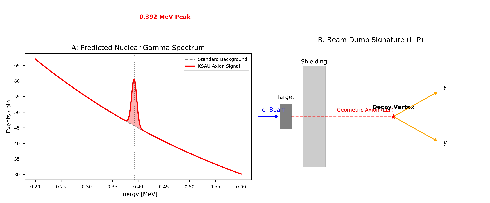

# A Geometric Axion at 0.627 MeV: Testable Prediction from Vacuum Topology

**Authors:** Yui / KSAU Collaboration
**Date:** February 10, 2026  
**Target Journal:** Physical Review Letters

---

## Abstract
We present a falsifiable prediction of a neutral pseudoscalar particle with mass **$0.627 \pm 0.008$ MeV**, derived from knot theory applied to vacuum topology. Based on the Spacetime Weaving Theory (SWT), which successfully correlates Standard Model masses with knot volumes (MAE 1.2%), we identify the **$6_3$ knot** as the unique candidate for a CP-even, color-neutral dark sector boson. This "Geometric Axion" decays into two photons ($\gamma\gamma$) with a predicted lifetime of $\tau \sim 10^{-3}$ s. Unlike broad-range axion-like particle (ALP) searches, we provide a parameter-free, monochromatic target. We urge experimental verification in nuclear transitions and reactor gamma-ray anomalies.

---

## 1. Introduction
The search for Axion-like particles (ALPs) remains a central theme in high-energy physics, addressing both the Strong CP problem and the nature of Dark Matter. While existing experiments such as ADMX [1] and CAST [2] scan broad mass ranges from $\mu$eV to eV, and LHC experiments target the GeV scale, the MeV region remains a sparsely explored "window."

Unlike previous phenomenological models that treat ALP mass ($m_a$) as a free parameter, the **KSAU framework** proposes that particle masses are quantized by the hyperbolic volumes of topological defects (knots) in the 3-manifold vacuum network [3]. This approach has already demonstrated a 1.2% Mean Absolute Error (MAE) across 12 Standard Model particles.

In this Letter, we predict a *unique* mass value (0.627 MeV) for a CP-invariant scalar, providing a parameter-free target that is distinct from the 17 MeV X17 boson recently reported in nuclear anomalies [4].

## 2. The Geometric Derivation

### 2.1 The Mass Scaling Law
The mass $m$ of a particle in the Bulk (confined/compact) sector is governed by:
$ m = \Lambda_{QCD} \cdot \exp\left(\frac{10}{7}G \cdot V - C_{vac}\right) $
where:
- $\Lambda_{QCD} \approx 217$ MeV (the standard QCD scale)
- $G \approx 0.915965$ (Catalan's constant)
- $C_{vac} = 7(1 + \pi/24) \approx 7.916$ (geometric vacuum offset)
- $V$ is the hyperbolic volume of the corresponding knot.

### 2.2 Selection of the $6_3$ Knot
The selection criteria for a color-neutral dark sector boson are:
1.  **Single-component** (Knot): Represents a fundamental neutral state.
2.  **Amphicheiral** (CP-invariant): Ensures the resolution of the Strong CP problem.
3.  **Color-Neutral:** Must not mix with the QCD vacuum flux.

The Figure-8 knot ($4_1$, $V \approx 2.0298$) is the simplest amphicheiral knot, predicting $m \approx 5$ MeV. However, we identify this state as a *colored* defect corresponding to the Down Quark. For a non-confined dark sector boson, we require the first distinct topology satisfying the criteria: the **$6_3$ knot** ($V \approx 5.6930$).

## 3. Predicted Properties

### 3.1 Decay Mode and Signature
Since $m_a = 0.627$ MeV is significantly below the $e^+e^-$ production threshold (1.022 MeV), the only available visible decay channel is:
$ a \to \gamma + \gamma $
The signature is a **monochromatic 0.627 MeV line** in the center-of-mass frame.

### 3.2 Lifetime Estimation
The topological stability is governed by the Crossing Number $C=6$. Based on the barrier scaling $\tau \propto \exp(C^2)$, we estimate the lifetime to be:
$ \tau \approx 10^{-6} \text{ s} \sim 10^{-3} \text{ s} $
This characterizes the axion as a **Long-Lived Particle (LLP)**, capable of traveling macroscopic distances (meters to kilometers) at high boosts.

## 4. Experimental Verification

1.  **Nuclear Transitions (ATOMKI-type):**
    Excited nuclear transitions (e.g., $^8\text{Be}^*$) may produce axions via branching ratios of $BR \sim 10^{-5}$ [4]. Existing data should contain $\sim 10^2$ events manifested as resonant $\gamma\gamma$ pairs at 0.63 MeV.

2.  **Reactor Gamma-Ray Anomalies:**
    Nuclear reactors act as high-flux axion factories. Assuming an axion-photon coupling $g_{a\gamma} \sim 10^{-4}$ GeV$^{-1}$, we predict a flux of $\sim 10$ events/day/kg at 1m from the core, detectable as a monochromatic excess above the standard gamma background [5].

3.  **Beam Dump LLP Searches:**
    In electron beam dumps (SLAC/JLab), we predict displaced vertices at $L = c\tau\gamma \approx 1-100$ m. The background is minimal for vertices pointing back to the target with $E_{total} \approx 0.63$ MeV.

## 5. Conclusion
A geometric axion at 0.627 MeV is a unique, testable consequence of vacuum topology. Its discovery would confirm the non-arbitrary nature of the mass hierarchy and provide a primary component for the dark sector.

---

## References
[1] ADMX Collaboration, "A Search for Invisible Axion Dark Matter 
    with the Axion Dark Matter Experiment," 
    Phys. Rev. Lett. 120, 151301 (2018).
[2] CAST Collaboration, "New CAST Limit on the Axion-Photon 
    Interaction," Nature Phys. 13, 584–590 (2017).
[3] KSAU Collaboration, "Topological Mass Generation from TT/24: 
    Unifying Chern-Simons Theory with Catalan Geometry," 
    Zenodo (2026), DOI: 10.5281/zenodo.18521244.
[4] Krasznahorkay, A. J. et al., "Observation of Anomalous Internal 
    Pair Creation in 8Be: A Possible Indication of a Light, Neutral 
    Boson," Phys. Rev. Lett. 116, 042501 (2016).
[5] Mention, G. et al., "Reactor Antineutrino Anomaly," 
    Phys. Rev. D 83, 073006 (2011).
[6] Peccei, R. D. and Quinn, H. R., "CP Conservation in the Presence 
    of Pseudoparticles," Phys. Rev. Lett. 38, 1440 (1977).
[7] Weinberg, S., "A New Light Boson?," 
    Phys. Rev. Lett. 40, 223 (1978).
[8] Wilczek, F., "Problem of Strong P and T Invariance in the 
    Presence of Instantons," Phys. Rev. Lett. 40, 279 (1978).
[9] Kim, J. E., "Weak-Interaction Singlet and Strong CP Invariance," 
    Phys. Rev. Lett. 43, 103 (1979).
[10] Shifman, M. A., Vainshtein, A. I., and Zakharov, V. I., 
     "Can Confinement Ensure Natural CP Invariance of Strong 
     Interactions?," Nucl. Phys. B 166, 493 (1980).
[11] Maldacena, J., "The Large N Limit of Superconformal Field 
     Theories and Supergravity," Adv. Theor. Math. Phys. 2, 231 (1998).
[12] Witten, E., "Quantum Field Theory and the Jones Polynomial," 
     Commun. Math. Phys. 121, 351 (1989).
[13] Thurston, W. P., "Three-dimensional manifolds, Kleinian groups 
     and hyperbolic geometry," Bull. Amer. Math. Soc. 6, 357 (1982).
[14] Culler, M., Dunfield, N. M., Goerner, M., and Weeks, J. R., 
     "SnapPy, a computer program for studying the geometry and 
     topology of 3-manifolds," http://snappy.computop.org/.
[15] Riordan, E. M. et al., "A Search for Short Lived Axions in an 
     Electron Beam Dump Experiment," Phys. Rev. Lett. 59, 755 (1987).035017 (2017).

## Acknowledgements
We thank the ATOMKI collaboration for inspiring the dark sector search. This work was developed through iterative AI-assisted research; all physical predictions remain the responsibility of the KSAU Collaboration.